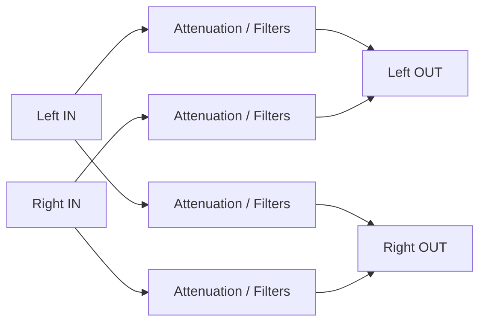
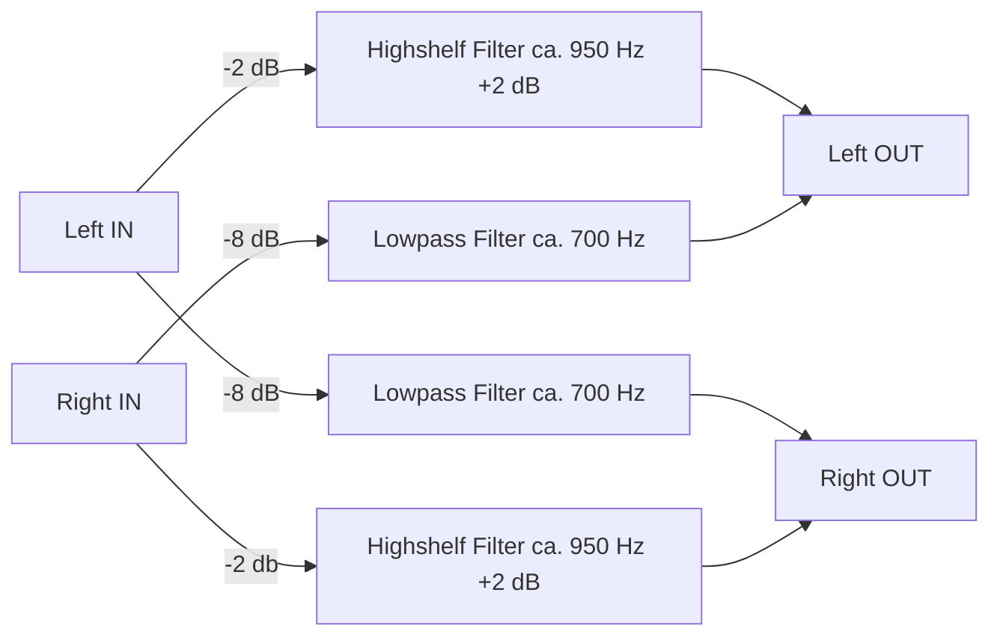

# AutoEq2CamillaDSP

This is a simple CLI tool to easily create a configuration file for your Headphones or IEMs using Headphone-Correction-Data from Jaakko Pasanen's [AutoEq](https://github.com/jaakkopasanen/AutoEq) to use with Henrik Enquist's [CamillaDSP](https://github.com/HEnquist/camilladsp). `CamillaDSP` is no e.g included in [moOde audio player](https://github.com/moode-player/moode). Using it stand alone on all major systems is well documented in [Processing audio](https://github.com/HEnquist/camilladsp#processing-audio) of the documentation.

## Things To Do
- [ ] Include different Crossfeed options
- [ ] Option to include Highshelf and/or Lowshelf with sensible defaults

## Devices Section
The CamillaDSP configuration starts with a `devices` section which will be specific to the equipment you are using. In order to include this section just put it in a `.yml` file and it can be read and added to your configuration.  
Please refer to the [CamillaDSP Readme](https://github.com/HEnquist/camilladsp#configuration) for more information about this section.
If you do not include your own `devices` file, the configuration will be built with a default which works as is in `moOde`.

## Crossfeed
You can include [Crossfeed](https://en.wikipedia.org/wiki/Crossfeed) in your configuration file.  
The basic principle of this is to reduce the channel separation of the stereo signal by feeding a little amount of the lower frequency range from left to right and vice versa.  

### Basic Crossfeed

### General Information
Two my knowledge there are two main publications most implementation of crossfeed are based on:  
- *Stereophonic Earphones and Binaural Loudspeakers* by [Benjamin B. Bauer](https://en.wikipedia.org/wiki/Benjamin_Bauer) published JAES Volume 9 Number 2 in 1961
- [Improved Headphone Listening](https://www.linkwitzlab.com/headphone-xfeed.htm) by [Siegfried Linkwitz](https://en.wikipedia.org/wiki/Siegfried_Linkwitz) published in Audio in 1973  

The most wide used DSP implementation of crossfeed might be Boris Mikhaylov's [Bauer stereophonic-to-binuaral DSP / bs2b](http://bs2b.sourceforge.net) or `bs2b`. Mikhaylov also provides a lot of interesting background, research and explanation on his design decissions for `bs2b`.

Two `CamillaDSP` related crossfeed projects worth looking into are Yue Wang's [camilladsp-crossfeed](https://github.com/Wang-Yue/camilladsp-crossfeed) and [CamillaDSP-Monitor](https://github.com/Wang-Yue/CamillaDSP-Monitor).

I can also highly recommend Mikhail Mnaganov's [Electronic Projects](https://melp242.blogspot.com/) blog which provides a lot of in depth information on various audio topics.

### Pow Chu Moy Crossfeed

This preset is based on the analogue implementation by [Pow Chu Moy](https://jourshifi.wordpress.com/2016/03/17/the-hero-of-diy-audio-pow-chu-moy/) who designed an [An Acoustic Simulator For Headphone Amplifiers](https://headwizememorial.wordpress.com/2018/03/09/an-acoustic-simulator-for-headphone-amplifiers/) which in turn is based on the implementation by [Siegfried Linkwitz](https://en.wikipedia.org/wiki/Siegfried_Linkwitz) which was published as [Improved Headphone Listening](https://www.linkwitzlab.com/headphone-xfeed.htm) 1973 in Audio.  

The DSP version of this draws from Boris Mikhaylov's [Bauer stereophonic-to-binuaral DSP / bs2b](http://bs2b.sourceforge.net) implementation in the widely used `bs2b`.  

