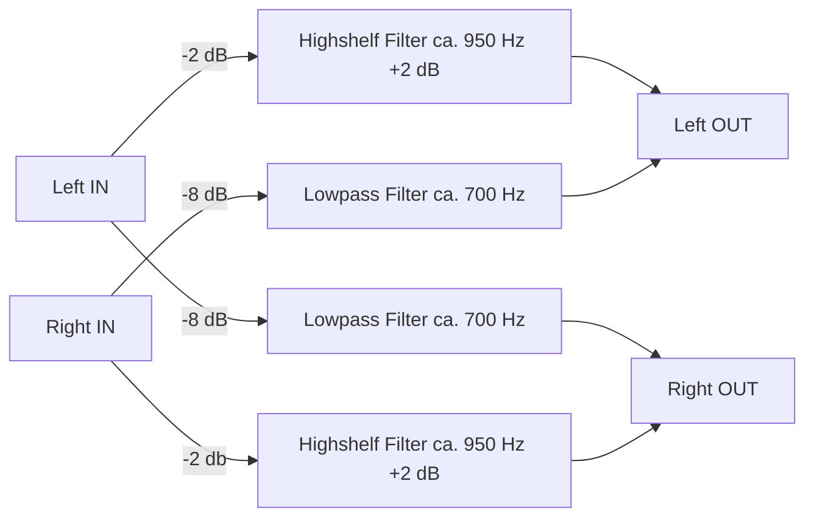

# AutoEq2CamillaDSP

This is a simple tool to easily create a configuration file for your Headphones or IEMs using Headphone-Correction-Data from Jaakko Pasanen's [AutoEq](https://github.com/jaakkopasanen/AutoEq) to use with Henrik Enquist's [CamillaDSP](https://github.com/HEnquist/camilladsp) which e.g is now available in [moOde audio player](https://github.com/moode-player/moode).

## Things ToDo
- [ ] Include different Crossfeed options
- [ ] Option to include Highshelf and/or Lowshelf with sensible defaults

## Devices Section
The CamillaDSP configuration starts with a `devices` section which will be specific to the equipment you are using. In order to include this section just put it in a `.yml` file and it can be read and added to your configuration.

## Crossfeed
You can include [Crossfeed](https://en.wikipedia.org/wiki/Crossfeed) in your configuration file.  
The basic principle of this is to reduce the channel separation of the stereo signal by feeding a little amount of the lower frequency range from left to right and vice versa.  

At the moment there is only one option which is based on the analogue implementation by [Pow Chu Moy](https://jourshifi.wordpress.com/2016/03/17/the-hero-of-diy-audio-pow-chu-moy/) who designed an [An Acoustic Simulator For Headphone Amplifiers](https://headwizememorial.wordpress.com/2018/03/09/an-acoustic-simulator-for-headphone-amplifiers/) which in turn is based on the (to my knowledge) first published implementation by [Siegfried Linkwitz](https://en.wikipedia.org/wiki/Siegfried_Linkwitz) which was published as [Improved Headphone Listening](https://www.linkwitzlab.com/headphone-xfeed.htm) 1973 in Audio.  

The DSP version of this draws from Boris Mikhaylov's [Bauer stereophonic-to-binuaral DSP / bs2b](http://bs2b.sourceforge.net) implementation and Yue Wang's [camilladsp-crossfeed](https://github.com/Wang-Yue/camilladsp-crossfeed).

